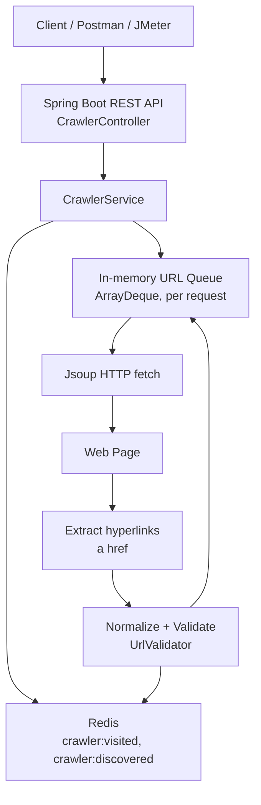

# System Design Laboratory - Experiment 8

## Design and Develop a Web Crawler for Automated Web Content Discovery

## Objective

Build a web crawler that accepts a seed URL, retrieves the page, extracts
hyperlinks, and discovers new pages breadth-first while never re-crawling a
URL it has already visited. The crawler is exposed through a REST API, uses
Redis to track visited/discovered URLs, and is deployable with Docker
Compose alongside Redis.

## Technologies Used

| Technology  | Purpose                                    |
|-------------|---------------------------------------------|
| Java 17     | Implementation language                      |
| Spring Boot 3.3.4 | REST API, dependency injection, configuration |
| Maven       | Build tool                                   |
| Jsoup 1.18.1| HTML fetching and parsing (no regex parsing) |
| Redis       | Visited-URL set, discovered-URL set          |
| Docker / Docker Compose | Packaging and local deployment   |
| Postman     | Manual API testing                           |
| JMeter      | Concurrent-load performance testing          |

## Architecture



## Project Structure

```
web-crawler/
├── pom.xml
├── Dockerfile
├── docker-compose.yml
├── README.md
├── postman/
│   └── WebCrawler.postman_collection.json
├── sample-pages/
│   ├── index.html
│   ├── page1.html
│   ├── page2.html
│   └── page3.html
├── src/
│   ├── main/
│   │   ├── java/com/example/webcrawler/
│   │   │   ├── WebCrawlerApplication.java
│   │   │   ├── controller/
│   │   │   │   ├── CrawlerController.java
│   │   │   │   └── GlobalExceptionHandler.java
│   │   │   ├── service/
│   │   │   │   └── CrawlerService.java
│   │   │   ├── model/
│   │   │   │   ├── CrawlRequest.java
│   │   │   │   └── CrawlResponse.java
│   │   │   ├── util/
│   │   │   │   └── UrlValidator.java
│   │   │   └── config/
│   │   │       ├── RedisConfig.java
│   │   │       └── CrawlerProperties.java
│   │   └── resources/
│   │       └── application.properties
│   └── test/java/com/example/webcrawler/
│       └── UrlValidatorTest.java
```

## Key Design Decisions

- **Queue scope**: the active URL queue (`ArrayDeque`) is created fresh
  inside `CrawlerService.crawl()` for each `POST /api/crawl` call. This keeps
  the implementation simple - no shared mutable queue to synchronize - while
  still letting multiple crawl requests run concurrently, each bounded by
  its own `maxPages`.
- **Visited state is global and lives in Redis** (`crawler:visited`), not
  per-request. This is deliberate: it is what lets you demonstrate that a
  second crawl of the same seed does no repeated work, and it is what makes
  concurrent requests safe - see "Concurrency" below.
- **Atomic claim**: before fetching a URL, the service calls
  `SADD crawler:visited <url>`. Redis's `SADD` returns `1` only for the
  caller that actually inserted the member, `0` if it was already present.
  This turns "check if visited, then mark as visited" into a single atomic
  operation, so two concurrent requests racing on the same URL can never
  both fetch it.
- **Same-host scope by default**: only links on the same host as the seed
  URL are enqueued for crawling. External links are still recorded in
  `crawler:discovered` for reporting, but not fetched, unless
  `crawlExternalLinks: true` is set in the request.
- **SSRF protection**: `UrlValidator` resolves every hostname (seed URL,
  every discovered link, and the final URL after any redirect) and rejects
  loopback, link-local, site-local (private), any-local, and multicast
  addresses, in addition to rejecting non-http(s) schemes. This prevents the
  crawler from being pointed at internal infrastructure. A single
  `CRAWLER_ALLOW_LOCAL_TARGETS=true` environment variable disables this
  check for local development/demo only (see "Local Demo Dataset" below);
  it defaults to `false`.

## Algorithm

1. Start the Spring Boot application.
2. Receive seed URL through REST API (`POST /api/crawl`).
3. Validate seed URL (scheme, format, SSRF safety) and normalize it.
4. Initialize an empty URL queue.
5. Add the seed URL to the queue.
6. While the queue is not empty and `maxPages` has not been reached:
   1. Remove a URL from the front of the queue (FIFO -> breadth-first).
   2. Atomically claim the URL against Redis's `crawler:visited` set.
   3. If it was already claimed (visited), skip it.
   4. Otherwise, retrieve the HTML page with Jsoup.
   5. Parse the page and extract all `a[href]` hyperlinks.
   6. Resolve each link to an absolute URL, normalize it, and validate it.
   7. Record every valid link in `crawler:discovered`.
   8. Enqueue links that are on the same host (or all links, if
      `crawlExternalLinks` is true) and not already queued this run.
7. Return crawl statistics (pages visited, URLs discovered, duration, etc.)
   through the REST API.
8. Test the APIs using Postman.
9. Deploy Spring Boot and Redis together using Docker Compose.
10. Generate concurrent requests using JMeter.
11. Record and analyze performance.

## Prerequisites

- Java 17+
- Maven 3.8+ (or use the included `mvnw`/`mvnw.cmd` if you generate one)
- Redis (via Homebrew/apt, or Docker)
- Docker + Docker Compose (for containerized deployment)
- Postman (for manual API testing)
- Apache JMeter (for performance testing)

## Running Redis Locally

macOS (Homebrew):
```bash
brew install redis
redis-server --daemonize yes
redis-cli ping   # expect PONG
```

Linux (apt):
```bash
sudo apt-get install redis-server
sudo service redis-server start
```

Or simply run Redis in Docker without the app:
```bash
docker run -d --name redis -p 6379:6379 redis:7-alpine
```

## Running the Spring Boot App Locally

```bash
mvn clean package -DskipTests
java -jar target/webcrawler.jar
```

The app starts on `http://localhost:8080` and connects to Redis at
`localhost:6379` by default (see `application.properties`).

To run against Redis on a different host/port:
```bash
REDIS_HOST=myredis REDIS_PORT=6380 java -jar target/webcrawler.jar
```

## Running with Docker Compose

```bash
docker compose up --build
```

This builds the Spring Boot image (multi-stage Dockerfile) and starts both
`redis` and `crawler` containers. Inside the Docker network, the app
connects to Redis using the service hostname `redis` (set via the
`REDIS_HOST`/`REDIS_PORT` environment variables in `docker-compose.yml`),
not `localhost`. The API is reachable on the host at `http://localhost:8080`.

Stop with:
```bash
docker compose down
```

## REST API Documentation

### `POST /api/crawl`

Request:
```json
{
  "seedUrl": "https://example.com",
  "maxPages": 10
}
```
- `seedUrl` (required): the starting URL.
- `maxPages` (optional): defaults to `10` (`crawler.default-max-pages`),
  capped at `100` (`crawler.max-allowed-pages`) even if a larger value is
  requested.
- `crawlExternalLinks` (optional, default `false`): if `true`, links off the
  seed's host are crawled too, not just recorded.

Response (200 OK):
```json
{
  "seedUrl": "https://example.com/",
  "pagesVisited": 5,
  "urlsDiscovered": 12,
  "visitedUrls": ["https://example.com/", "https://example.com/about"],
  "failedUrls": [],
  "durationMs": 350,
  "status": "COMPLETED",
  "message": null
}
```

Response on invalid seed URL (400 Bad Request):
```json
{
  "status": "ERROR",
  "message": "Invalid seed URL"
}
```

### `GET /api/visited`

Returns the full set of visited URLs currently stored in Redis:
```json
["https://example.com/", "https://example.com/about"]
```

### `GET /api/status`

Returns Redis connectivity and counts:
```json
{ "redisConnected": true, "visitedCount": 5, "discoveredCount": 12 }
```

### `DELETE /api/reset`

Clears all crawler state (`crawler:visited` and `crawler:discovered`) so a
demonstration can be repeated from a clean state:
```json
{ "status": "RESET", "message": "Crawler state cleared" }
```

## curl Examples

```bash
# Crawl
curl -X POST http://localhost:8080/api/crawl \
  -H "Content-Type: application/json" \
  -d '{"seedUrl": "https://example.com", "maxPages": 5}'

# Visited URLs
curl http://localhost:8080/api/visited

# Status
curl http://localhost:8080/api/status

# Reset
curl -X DELETE http://localhost:8080/api/reset
```

## Postman Testing

Import `postman/WebCrawler.postman_collection.json` into Postman (or build
these requests manually against `http://localhost:8080`).

**TEST 1 - Normal crawl**
`POST /api/crawl` with `{"seedUrl": "https://example.com", "maxPages": 5}`.
Expect `200 OK`, `status: COMPLETED`, `pagesVisited >= 1`.

**TEST 2 - Repeated seed URL**
Immediately repeat TEST 1 with the same body. Expect `200 OK` with
`pagesVisited: 0` and an empty `visitedUrls` array - Redis's visited set
already contains the URL from TEST 1, so the atomic `SADD` claim fails and
the page is not re-fetched.

**TEST 3 - Invalid URL**
`POST /api/crawl` with `{"seedUrl": "javascript:alert(1)"}`. Expect
`400 Bad Request`, `status: ERROR`, `message: "Invalid seed URL"`.

**TEST 4 - Visited URL endpoint**
`GET /api/visited`. Expect a JSON array containing the URLs from TEST 1.

**TEST 5 - Reset endpoint**
`DELETE /api/reset`. Expect `{"status": "RESET", ...}`. Follow with
`GET /api/status` to confirm `visitedCount: 0`.

**TEST 6 - Crawl again after reset**
Repeat TEST 1's request. Expect `pagesVisited >= 1` again, proving the reset
actually cleared Redis state.

## Redis Verification

```bash
redis-cli
SMEMBERS crawler:visited
SMEMBERS crawler:discovered
SCARD crawler:visited
```

## Local Demo Dataset (sample-pages/)

`sample-pages/index.html`, `page1.html`, `page2.html`, `page3.html` are
small static pages that link to each other, including a duplicate link
(`index.html` links to `page1.html` twice) and a cycle
(`page1 -> page2 -> page1`), specifically to prove the visited-URL
mechanism: every page should appear exactly once in the result even though
it is linked from multiple places.

Because the crawler blocks localhost/private addresses by default (SSRF
protection), this local demo requires a development-only override:

```bash
# Serve the sample pages on port 9000
cd sample-pages && python3 -m http.server 9000

# In another terminal, run the app with local targets explicitly allowed
CRAWLER_ALLOW_LOCAL_TARGETS=true java -jar target/webcrawler.jar

# Crawl it
curl -X POST http://localhost:8080/api/crawl \
  -H "Content-Type: application/json" \
  -d '{"seedUrl": "http://localhost:9000/index.html", "maxPages": 10}'
```

Expected result: `pagesVisited: 4` (index, page1, page2, page3), each
appearing once in `visitedUrls` despite the duplicate and cyclic links, and
the external `https://www.wikipedia.org` link appearing in
`crawler:discovered` but not in `visitedUrls`.

Do **not** set `CRAWLER_ALLOW_LOCAL_TARGETS=true` for the normal
public-internet demonstration.

## JMeter Performance Testing

1. Open JMeter and create a new Test Plan.
2. Add a **Thread Group** (Test Plan -> Add -> Threads (Users) -> Thread
   Group).
3. Add an **HTTP Request** sampler (Thread Group -> Add -> Sampler -> HTTP
   Request):
   - Method: `POST`
   - Server Name/IP: `localhost`, Port: `8080`
   - Path: `/api/crawl`
   - Body Data:
     ```json
     {"seedUrl": "https://example.com", "maxPages": 3}
     ```
4. Add an **HTTP Header Manager** (Add -> Config Element -> HTTP Header
   Manager) with `Content-Type: application/json`.
5. Add a **Summary Report** and an **Aggregate Report** (Add -> Listener).
6. Run the test at increasing thread counts: **1, 5, 10, 25, 50** users,
   with Loop Count = 1 (or a small fixed number), and a short ramp-up
   period (e.g. equal to the thread count in seconds).
7. Prefer `https://example.com` or the local `sample-pages` demo (with
   `CRAWLER_ALLOW_LOCAL_TARGETS=true`) as the crawl target during load
   testing, with a small `maxPages`, so the test does not generate heavy
   concurrent traffic against a third-party site you do not control.
8. For each run, read from the **Summary Report**: Samples, Average,
   Min, Max, Error %, Throughput. Read the 90th/95th percentiles from the
   **Aggregate Report**.
9. Record results in the table below.

### Performance Results Table (fill in after running JMeter)

| Concurrent Users | Avg Response Time (ms) | Throughput | Error % |
|-------------------|------------------------|------------|---------|
| 1                 |                        |            |         |
| 5                 |                        |            |         |
| 10                |                        |            |         |
| 25                |                        |            |         |
| 50                |                        |            |         |

*(Numbers must come from your own JMeter run - none are pre-filled here.)*

## LAB ANALYSIS

**URL Queue** - A FIFO data structure holding URLs that have been
discovered but not yet processed. Because it is FIFO, removing from the
front and adding new discoveries to the back naturally produces
breadth-first crawling: all pages at depth *n* from the seed are visited
before any page at depth *n+1*.

**Seed URL** - The single starting URL supplied by the client. It is the
only URL known before the crawl begins; every other URL is discovered by
following links from it (or from pages reached from it).

**Visited-URL Set** - A set (here, a Redis Set) of URLs that have already
been fetched. Before fetching any URL, the crawler checks/claims membership
in this set, so a page already processed is never fetched or parsed again -
this is what keeps crawling of cyclic link structures finite.

**Web Crawler** - A program that automates content discovery by repeating:
retrieve a page -> parse it -> discover the hyperlinks on it -> enqueue the
unvisited, valid ones -> repeat until a stopping condition (empty queue or a
page limit) is reached.

**Redis Cache** - An in-memory key-value store. Set membership checks
(`SISMEMBER`/`SADD`) run in O(1) average time, which is why Redis is a good
fit for the visited-URL lookup: this operation happens once per URL
encountered, potentially many times per crawl, and it needs to be both fast
and atomic so concurrent crawl requests do not race on the same URL. Redis
also naturally shares this state across concurrent requests to the same
running instance (and, if scaled, across multiple app instances).

## Answers to the Six Analysis Questions

**Q1. How does the crawler discover new URLs from a retrieved web page?**
Jsoup parses the fetched HTML into a DOM and `document.select("a[href]")`
selects every anchor element with an `href` attribute. For each anchor,
`link.absUrl("href")` resolves the (possibly relative) href against the
page's own URL to get an absolute URL. That absolute URL is then normalized
(fragment stripped, trailing slash on bare paths removed, host
lower-cased) and validated (scheme, well-formedness, SSRF safety) before it
is considered a candidate for crawling.

**Q2. How does the system determine whether a newly discovered URL should
be crawled?**
A discovered URL is queued for crawling only if all of the following hold:
it is a well-formed `http`/`https` URL (`UrlValidator`); it does not resolve
to a localhost/private/link-local address (SSRF check); it belongs to the
same host as the seed URL, unless `crawlExternalLinks` was explicitly set;
it has not already been added to the queue during this crawl run
(`queuedInThisRun` set); and the crawl's `maxPages` budget has not yet been
exhausted (checked in the main loop condition, not at enqueue time). It is
recorded in the discovered set regardless of the same-host check, so
external links still show up in reporting even though they are not fetched.

**Q3. How does the system process a URL that has not been visited?**
It is removed from the front of the queue, then atomically claimed by
calling `SADD crawler:visited <url>` on Redis - since the URL was not
previously a member, this call returns `1` and the claim succeeds. The
crawler then fetches the page with Jsoup, parses it, extracts and validates
its hyperlinks, enqueues the eligible new ones, and records the fetched
page in the response's `visitedUrls` list; the visited state itself is
already durably stored in Redis by the claim step.

**Q4. How does the system process a URL that has already been visited?**
The same `SADD` call is attempted, but since the URL is already a member of
`crawler:visited`, Redis returns `0` and the claim fails. The crawler
recognizes this as "already visited," skips the URL entirely (no HTTP
fetch, no parsing), and moves on to the next item in the queue. This is
what prevents duplicate network requests and duplicate processing, whether
the duplicate comes from a cycle in the current crawl or from a previous
crawl request entirely.

**Q5. Compare queue-based crawling with repeatedly scanning the complete
collection of URLs.**
Queue-based crawling with a visited-set lookup does O(1) work (amortized)
to decide "process next" and O(1) work (a Redis set operation) to check or
claim "already done," giving roughly O(V + E) total work for V pages and E
links - each page is fetched once and each link is examined once. Scanning
the entire known-URL collection on every step to find "the next unvisited
URL," or to check duplication by scanning a list instead of a set, is
O(n) per lookup and O(n^2) (or worse) overall as the number of known URLs
grows, since every new page potentially requires scanning everything
discovered so far. The queue plus set-membership approach scales to far
more pages before that per-step cost becomes a bottleneck.

**Q6. Analyze performance under different concurrent requests using
JMeter.**
Conceptually, as concurrency increases: throughput typically rises at
first as more requests are served in parallel and I/O waits (network calls
to the target site, Redis round-trips) overlap across threads. Beyond some
point, average response time starts increasing because CPU, thread-pool,
Redis-connection-pool, or outbound-network capacity becomes the limiting
factor and requests begin queueing. Under heavier load, Redis and network
contention increase (more concurrent `SADD` calls, more concurrent outbound
HTTP calls), and if concurrency is pushed far enough, timeouts or
connection errors can appear, raising the error percentage. The specific
numbers where each of these transitions occurs depend on your machine, JVM
heap/thread settings, and Redis configuration - fill in the results table
above from an actual JMeter run and describe the trend you actually
observed, rather than assuming a specific shape in advance.

## Expected Output

- Successful crawl: HTTP 200, `status: "COMPLETED"`, non-empty
  `visitedUrls` (unless everything was already visited), `durationMs > 0`.
- Repeated crawl of an already-visited seed: HTTP 200, `pagesVisited: 0`,
  empty `visitedUrls`.
- Invalid or unsafe seed URL: HTTP 400, `status: "ERROR"`.
- Redis unreachable: HTTP 503, JSON error body (no raw stack trace).

## Common Viva Questions

- **Why use a Set in Redis instead of a List for visited URLs?**
  Set membership checks and inserts are O(1) average time and Redis's
  `SADD` returning 0/1 gives an atomic "was this new?" answer in one round
  trip; a List would require a linear scan to check membership.
- **Why is the active queue in-memory instead of in Redis?**
  The lab experiment intentionally keeps the crawl queue simple and scoped
  to a single request/thread; only the state that must be shared and
  durable across requests (visited/discovered URLs) needs Redis. Moving the
  queue to Redis too would add complexity (e.g. `RPUSH`/`LPOP` with
  cross-request coordination) not required by the assignment.
- **How is a race condition between "check visited" and "mark visited"
  avoided?** By using a single atomic Redis command, `SADD`, instead of two
  separate calls (`SISMEMBER` then `SADD`). Two threads calling `SADD` on
  the same key concurrently are serialized by Redis itself (Redis is
  single-threaded for command execution), so only one of them can receive
  the "added" (`1`) result.
- **Why validate the final URL after redirects, not just the original
  URL?** A publicly reachable URL could issue an HTTP redirect to an
  internal address (e.g. `http://169.254.169.254/`) to bypass an initial
  scheme/host check. Re-validating `connection.response().url()` after
  Jsoup follows redirects closes that gap.
- **Why does `GET /api/visited` return a Redis Set and not a ordered
  list?** The visited URLs are stored in a Redis Set (`crawler:visited`)
  because uniqueness and O(1) membership checks matter far more than
  insertion order for this lab's purposes; `SMEMBERS` returns them in
  whatever order Redis happens to store them.

## Limitations

- The crawler is single-request-scoped: it crawls synchronously within one
  HTTP request and returns the full result when done, rather than running
  as a background job with a job ID you can poll. This keeps the REST API
  and the demo simple, at the cost of the client waiting for the whole
  crawl (bounded by `maxPages`) to finish before getting a response.
- The visited/discovered Redis sets are global, not scoped per crawl job.
  This is intentional for the lab (it is what makes "crawl the same seed
  twice" a meaningful demonstration of skip-if-visited behavior), but it
  means two different seed URLs that happen to link to the same page will
  only have that page crawled once, by whichever request reaches it first.
- Only same-host scoping is implemented for "domain" boundaries; it does
  not attempt more advanced scope policies (e.g. subdomain allow-lists,
  `robots.txt` compliance, or crawl-delay throttling).
- No persistence of crawl results is provided beyond Redis's own
  durability settings - there is no separate database, and crawl responses
  are not stored for later retrieval by ID.
- Non-HTML resources (images, PDFs, etc.) reached via `<a href>` are not
  specially detected before fetching; Jsoup's `ignoreContentType(false)`
  setting causes the fetch to fail gracefully for genuinely non-HTML
  responses, which is recorded in `failedUrls` rather than crashing the
  crawl.

## Troubleshooting

- **`Connection refused` connecting to Redis**: confirm Redis is running
  (`redis-cli ping` should return `PONG`) and that `REDIS_HOST`/
  `REDIS_PORT` match where it is actually listening. Inside Docker Compose,
  the app must use `REDIS_HOST=redis`, not `localhost`.
- **`Web server failed to start. Port 8080 was already in use.`**: another
  process (often a previous run of this same app) is bound to 8080. Find
  and stop it: `lsof -ti:8080 | xargs kill -9` (macOS/Linux), then restart.
- **Every crawl returns `pagesVisited: 0`**: the target URL is already in
  `crawler:visited` from a previous run. Call `DELETE /api/reset` to clear
  state before re-demonstrating.
- **Seed URL is rejected as "Invalid seed URL" even though it looks
  correct**: check that it uses `http://` or `https://` (not a bare
  `example.com`), and that it is not a localhost/private-network address -
  those are rejected by design (SSRF protection) unless
  `CRAWLER_ALLOW_LOCAL_TARGETS=true` is set for local demo purposes.
- **`docker compose up --build` fails to reach Redis**: make sure the
  `redis` service's healthcheck passes before the `crawler` service starts
  (compose file already declares `depends_on: redis: condition:
  service_healthy`); check `docker compose logs redis`.
- **JMeter shows a high error rate at low concurrency**: this usually means
  the target site under test (if using a real external URL) is rate
  limiting or slow to respond, not a bug in the crawler itself - switch to
  the local `sample-pages` demo target for controlled load testing.
